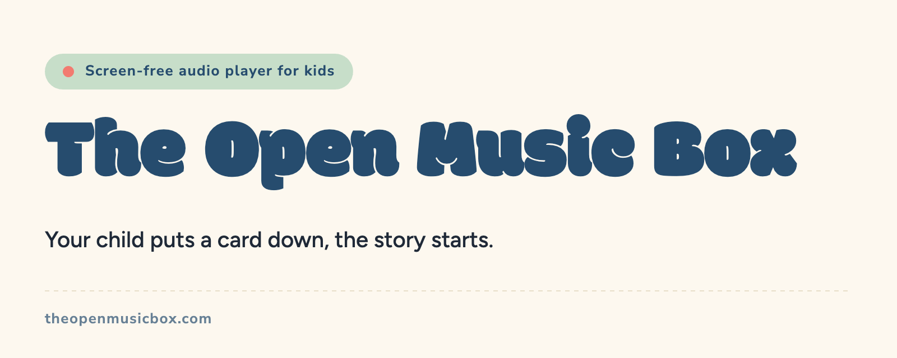
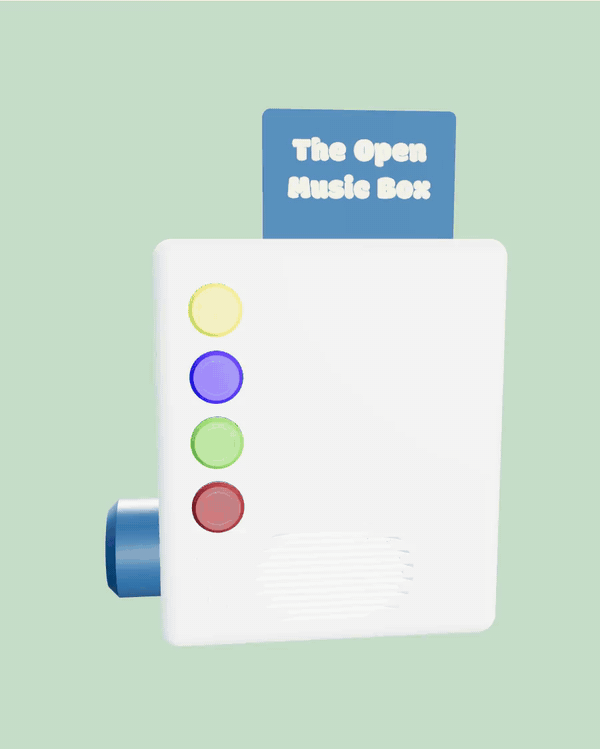

The MusicBox is a screen-free audio player for children. The child places an NFC card on top and the story or the music starts. No subscription, no account, no screen. Your music and your stories stay yours, on standard NFC cards, and every part can be replaced.

This is the enclosure of the V4 prototype of The Open Music Box project, designed around the HermitX development board.

  

From your phone, you add your music and your stories, you build playlists and you link each one to an NFC card. Then the child takes over: place a card on the MusicBox and it plays, take it off and it stops. Four buttons for volume and tracks, nothing else to learn. It works without internet, in the bedroom, in the car or at the grandparents.

The V4 enclosure is designed around the HermitX development board: an all-in-one ESP32-S3 board that ships with the NFC antenna, a 3 W speaker and an NTAG215 card. It prints in three parts, provided as STL and 3MF:

| Part | Files | What it is |
|---|---|---|
| **Body** | `TMB prototype V4 - body.{stl,3mf,glb}` | The main shell that holds the board and the speaker |
| **Top** | `TMB prototype V4 - top.{stl,3mf,step,glb}` | The lid with the card slot |
| **Insert** | `TMB prototype V4 - insert.{stl,3mf,glb}` | The card holder |

For the body, print the 3MF rather than the STL. It is a multi-material file: the side window is meant to be printed in a transparent filament so the light of the LEDs shows through, and the inner fins in a dark filament so that light does not bleed from one LED to the next. The STL is the single-material fallback, for slicers or workflows that need it.

Print settings used on the prototype: Prusa MK4S, 0.4 mm nozzle, 0.2 mm layers, PLA.

1. Print the three parts.
2. Get the HermitX development board and the few parts listed in the [BOM](https://theopenmusicbox.com/en/build/hardware/prototype/).
3. Flash the firmware straight from your browser, nothing to install: [Flash the firmware](https://theopenmusicbox.com/en/build/flash).
4. Install the app, add your music and stories, link them to NFC cards.

Everything you need is in the [full build guide](https://theopenmusicbox.com/en/build), BOM and wiring included.

This is a prototype enclosure and it is still evolving. Print results, photos and feedback are very welcome — open an [issue](https://github.com/The-Open-Music-Box/enclosure/issues) or come to the Discord.

| | | | | | | |
|:-:|:-:|:-:|:-:|:-:|:-:|:-:|
|  |  |  |  |  |  |  |
| Discord | Website | Instagram | Facebook | Bluesky | All links | Email |

---

**License:** [CERN-OHL-S v2](LICENSE.txt) (strongly reciprocal open hardware). You may print, modify, share and even sell hardware based on these files, as long as your modified design files remain open under the same licence, with attribution and a link to your source. See [NOTICE.txt](NOTICE.txt).

**Official source:** https://theopenmusicbox.com

**Trademark:** the files are free; the product names and brands of The Open Music Box are not. Compatible or derived boxes may not be sold under those names, which are reserved for certified units.
